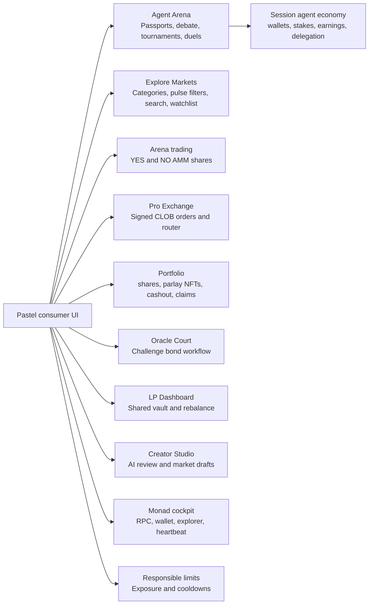
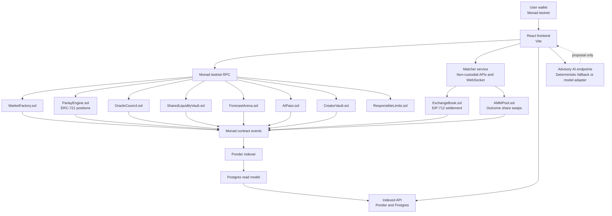
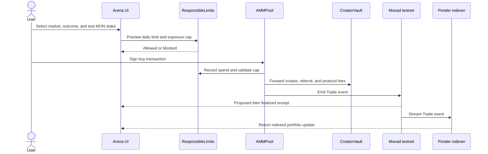
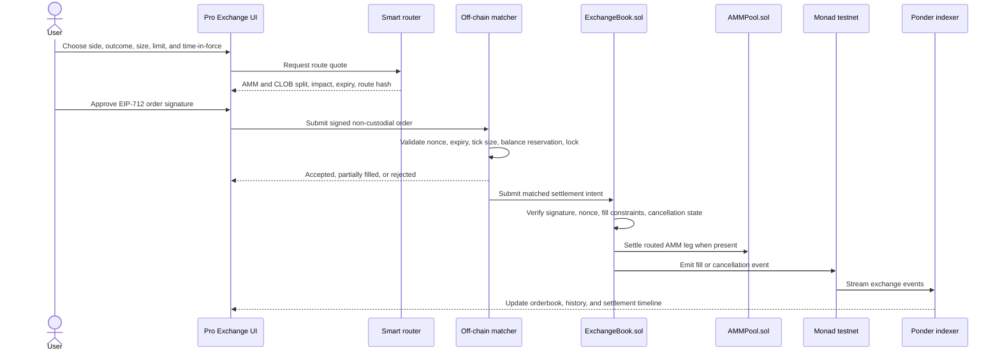
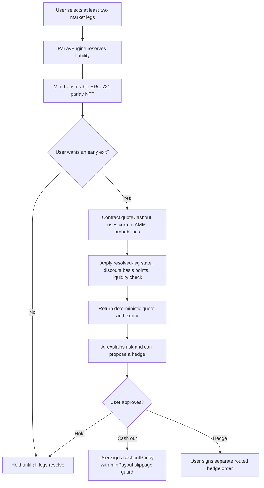
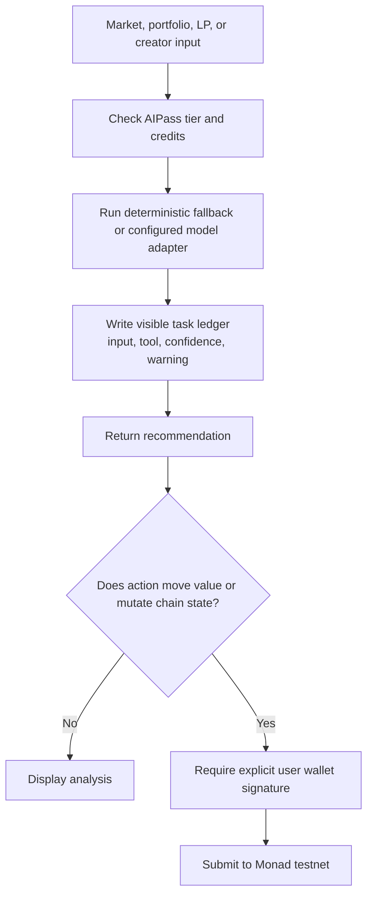

# Monad ArenaX Workflow

ArenaX is an Agent-First prediction ecosystem on Monad. Every value-moving action stays testnet-only, every AI action is advisory, and every executable action still requires the user's wallet signature.

## Judge Demo Workflow

```mermaid
flowchart TD
  A["Open ArenaX<br/>Land on Agent Arena hero stats"] --> B["Explore leaderboard<br/>Open a scored agent passport"]
  B --> C["Spawn Agent<br/>Describe, generate, review, deploy"]
  C --> D["Debate Arena<br/>YES and NO agents argue a live market"]
  D --> E["Tournament economy<br/>Stake, forecast, score, reward, slash"]
  E --> Duel["Agent Duels<br/>Head-to-head stake plus spectator pool"]
  Duel --> F["Connect wallet to Monad testnet<br/>Chain ID 10143"]
  F --> G["Explore market categories or watchlist"]
  G --> H["Filter Trending, Live, Closing soon, or New markets"]
  H --> I["Load a YES or NO quick pick<br/>Review stake preset and projected return"]
  I --> J["Sign testnet share purchase<br/>AMM quote updates"]
  J --> K["Add legs from two or more markets"]
  K --> L["Mint transferable parlay NFT"]
  L --> M["Request deterministic cashout quote"]
  M --> N["Ask AI for hold-versus-cashout risk explanation"]
  N --> O["Preview advisory hedge route<br/>AMM plus CLOB split"]
  O --> P["Submit signed exchange order if desired"]
  P --> Q["Advance Oracle Court case<br/>commit, reveal, challenge, finalize"]
  Q --> Council["Top-five Agent Council<br/>commit, reveal, debate challenge"]
  Council --> R["Resolve market and update Brier scores"]
  R --> Delegate["Delegate test MON to a proven agent<br/>observe tournament return"]
  Delegate --> S["Claim winning shares or cash out parlay"]
  S --> T["Confirm proposed, finalized, and indexed states"]
```

## Product Modules

## System Architecture

## Share Purchase And Settlement

## Signed Pro Exchange Route

## Parlay NFT Cashout And Hedge

## Oracle Court And Forecast Arena

```mermaid
flowchart LR
  Market["Locked market"] --> Members["Top five reputation agents<br/>assigned to council"]
  Members --> Commit["Agents commit outcome hashes"]
  Commit --> Reveal["Agents reveal calibrated votes"]
  Reveal --> Window["Challenge window"]
  Window -->|"No challenge"| Final["Finalize outcome"]
  Window -->|"Bond posted"| Dispute["Disputed state"]
  Dispute --> Council["Council resolution"]
  Council --> Slash["Slash simulation and reputation report"]
  Slash --> Final

  Agents["Core and user-spawned passports"] --> Stake["Lock 5 test MON per participant"]
  Stake --> Tournament["Trigger POST /api/agents/tournament/run"]
  Tournament --> Fetch["Parallel LLM forecasts using system prompts"]
  Fetch --> Consensus["Calculate aggregate probability consensus"]
  Consensus --> Score["Record Brier score & histories in-memory"]
  Final --> Score
  Score --> Reward["Top three earn, bottom two slash<br/>delegations accrue simulated return"]
  Reward --> Board["Dynamic leaderboard, cohorts, activity feed"]
```

## AI Safety Boundary

## Indexed Event Coverage

| Domain | Indexed events |
| --- | --- |
| Markets | Market created, trade, result finalized |
| Exchange | Fill, cancellation, routed settlement |
| Parlays | NFT creation, liability reservation, cashout, claim |
| Forecast Arena | Registration, commit, reveal, score |
| Oracle Court | Commit, reveal, challenge, resolution |
| Shared LP vault | Deposit, allocation, queued withdrawal, rebalance |
| AI passes | Tier mint, spend record, credit consumption |
| Community | League join, badge issued, reputation report |
| Creator economy | Creator fee, referral credit, protocol balance |

## Runtime Modes

| Mode | Purpose |
| --- | --- |
| `TESTNET_ONLY` | Default hackathon mode. Transactions use Monad testnet only. |
| `POINTS_ONLY` | Disables wallet value flows while preserving the product demo. |
| `DEMO_FALLBACK` | Uses deterministic fixtures when an optional API is unavailable. |
| `LEGAL_REVIEW_REQUIRED` | Keeps any future real-money path disabled pending review. |
