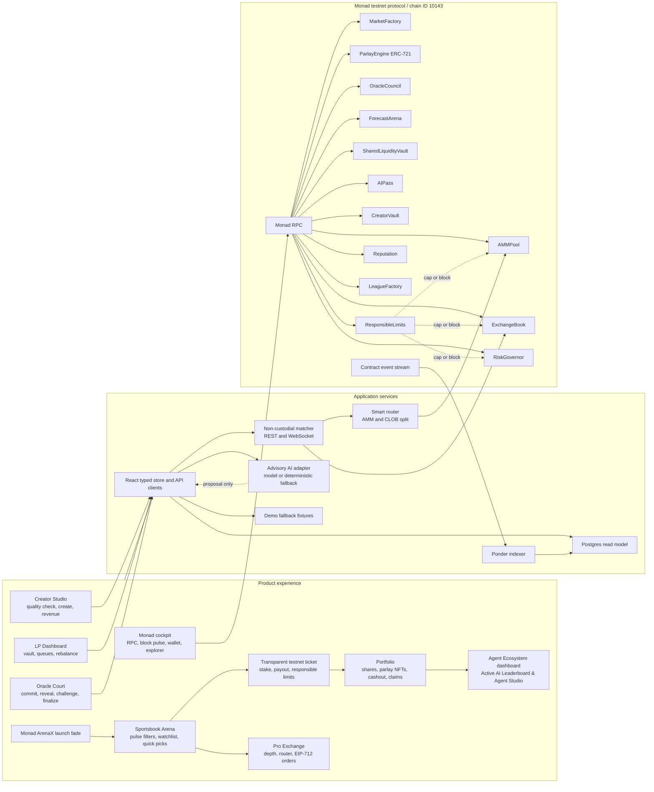
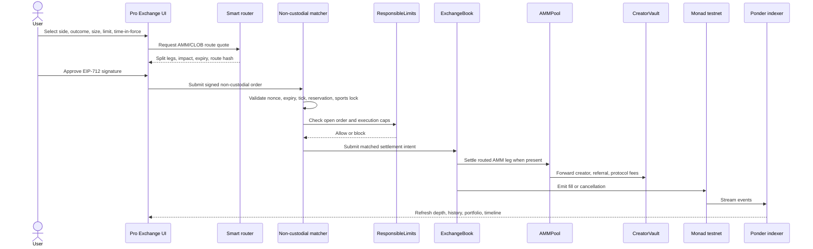
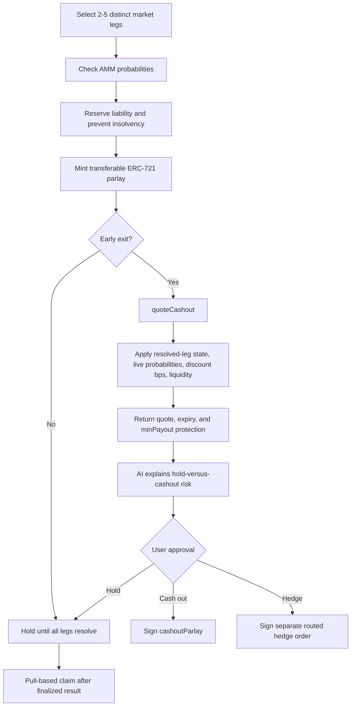
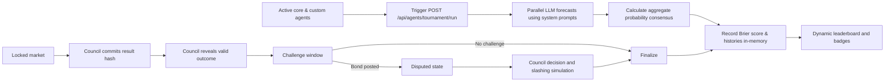
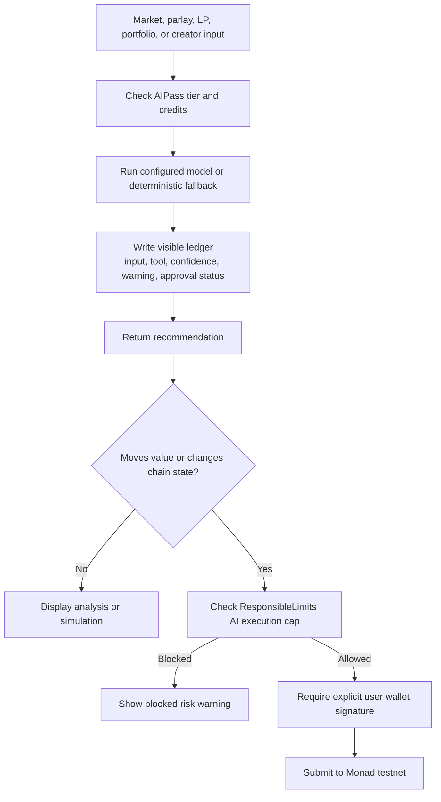
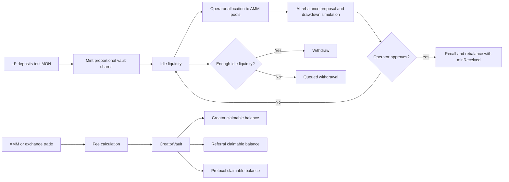
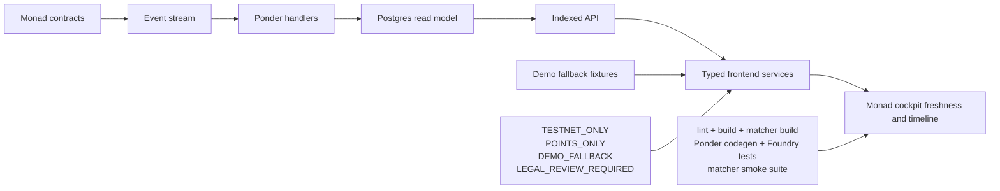

# Monad ArenaX Workflow and Architecture Source

This technical companion is the editable source map for the visual architecture pack. ArenaX is a Monad testnet-only prediction exchange: test MON has no monetary value, AI remains advisory, and state-changing actions require explicit wallet approval.

## One Inclusive Workflow

## Product Journey

```mermaid
flowchart TD
  A["Open ArenaX<br/>Lands on Agent Ecosystem default view"] --> B["Explore Agent Leaderboard<br/>Inspect ranks, Brier scores, strategy descriptions"]
  B --> C["Open Agent Studio<br/>Type custom persona description"]
  C --> D["Submit Agent Customization<br/>Gemini generates and registers new agent in-memory"]
  D --> E["Select Market & Run Tournament<br/>Active agents forecast in parallel and output consensus"]
  E --> F["Connect wallet to Monad testnet<br/>Chain ID 10143"]
  F --> G["Explore market categories or watchlist"]
  G --> H["Filter Trending, Live, Closing soon, or New markets"]
  H --> I["Load a YES or NO quick pick<br/>Review stake preset and projected return"]
  I --> J["Sign testnet share purchase<br/>AMM quote updates"]
  J --> K["Add legs from two or more markets"]
  K --> L["Mint transferable parlay NFT"]
  L --> M["Request deterministic cashout quote"]
  M --> N["Ask AI for hold-versus-cashout risk explanation"]
  N --> O["Preview advisory hedge route<br/>AMM plus CLOB split"]
  O --> P["Submit signed exchange order if desired"]
  P --> Q["Advance Oracle Court case<br/>commit, reveal, challenge, finalize"]
  Q --> R["Resolve market and update Brier scores"]
  R --> S["Claim winning shares or cash out parlay"]
  S --> T["Confirm proposed, finalized, and indexed states"]
```

## Smart Routing and Settlement

## Parlay NFT Cashout

## Oracle Court and Forecast Arena

## Agentic AI Safety Boundary

## Shared Vault and Creator Economy

## Indexer and Runtime Operations

## Contract Coverage

| Module | Responsibility | Visible or indexed behavior |
| --- | --- | --- |
| `MarketFactory.sol` | Market registry and lifecycle | Created, locked, disputed, finalized |
| `AMMPool.sol` | Outcome shares and liquidity | Quotes, probability movement, LP accounting, creator fees |
| `ExchangeBook.sol` | EIP-712 settlement | Nonce, fills, partial fills, cancellation |
| `ParlayEngine.sol` | Transferable ERC-721 parlays | Liability reserve, cashout, claim |
| `OracleCouncil.sol` | Result integrity | Commit, reveal, challenge bond, council resolution |
| `ForecastArena.sol` | Agent tournament | Registration, commit, reveal, Brier score |
| `SharedLiquidityVault.sol` | Shared LP capital | Deposit, allocation, queue, rebalance |
| `CreatorVault.sol` | Revenue accounting | Creator, referral, protocol balances |
| `AIPass.sol` | AI access | Tier mint, authorized credit consumption |
| `ResponsibleLimits.sol` | Usage controls | Position, open order, daily loss, AI execution caps |
| `RiskGovernor.sol` | Approval-only risk automation | Proposal, approval, execution, block |
| `Reputation.sol` | Authorized scoring | XP, scores, badges |
| `LeagueFactory.sol` | Community competition | Join, scoring, leaderboard |

