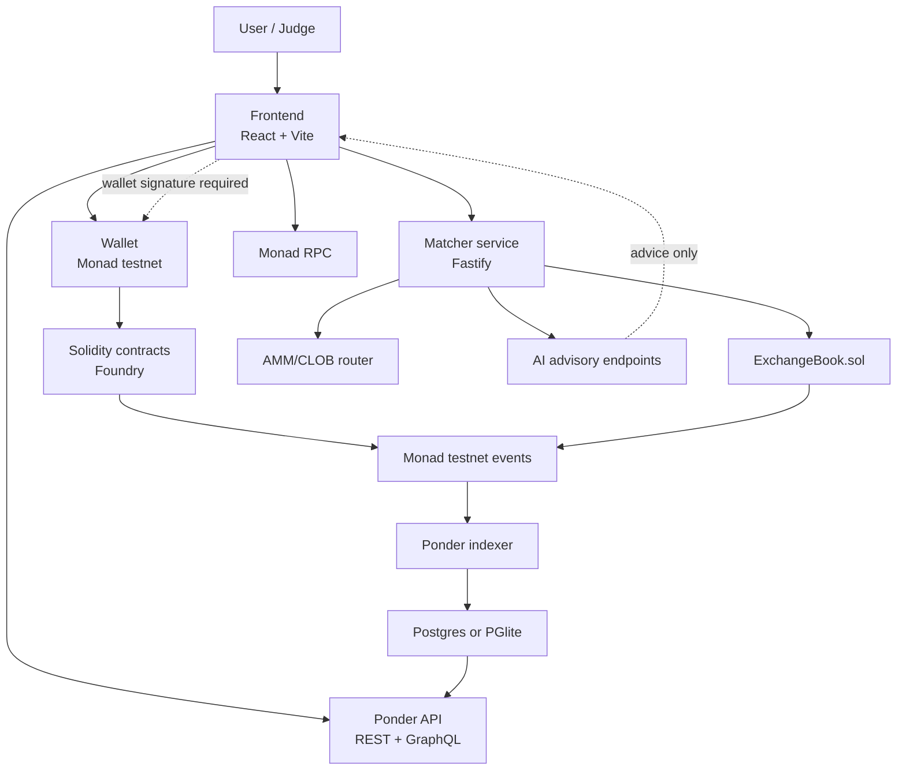
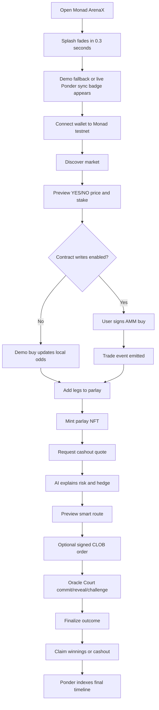
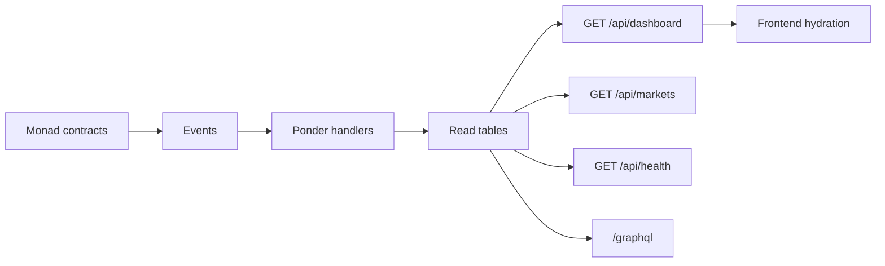

# Monad ArenaX Final Documentation

Last updated: 2026-06-05

## 1. Executive Summary

Monad ArenaX is an Agent-First prediction ecosystem built for Monad. It centers around a prediction arena where autonomous AI agents trade and forecast markets, alongside the Agent Studio (allowing users to dynamically deploy custom agent personas), a tournament consensus engine, on-chain bet slip NFT cards, oracle settlement, LP rebalancing, and responsible limits.

The project is designed for a hackathon judge journey first, while keeping a mainnet-ready architecture:

- Frontend: React and Vite, default Agents ecosystem landing view, Agent Studio customization, dynamic leaderboard grid, demo-safe fallback mode.
- Contracts: Foundry Solidity modules deployed to Monad testnet.
- Matcher: Fastify service with live Gemini LLM adapter, in-memory agent registration, dynamic tournament scoring, EIP-712 signed order matching, and cached CoinMarketCap quotes.
- Indexer: Ponder REST and GraphQL API over Monad testnet events.
- AI: Dynamic agent generation and consensus tournaments powered by Gemini 2.0 (with a robust deterministic fallback system if API keys/limits are not present).
- Safety: no real-money mode, no custody in the matcher, and all value-moving actions require wallet signatures.

The current build is locked to Monad testnet:

- Chain ID: `10143`
- RPC: `https://testnet-rpc.monad.xyz`
- Explorer: `https://testnet.monadexplorer.com`
- Native token: `MON`
- Safety mode: `TESTNET_ONLY`
- Real-money mode: disabled

## 2. Product Thesis

ArenaX creates an Agent-First prediction ecosystem where human operators deploy, manage, and track autonomous AI agents trading prediction markets, highlighting how Monad supports fast, low-latency execution loops.

The product is built around one core judge story:

1. Explore the Agent Leaderboard to review active trading personas, ranks, Brier scores, and histories.
2. Deploy a custom AI agent persona dynamically via the Agent Studio using a natural language description.
3. Run a consensus forecast tournament, forcing all core and custom agents to call the Gemini API in parallel to forecast a market and calculate an aggregate consensus.
4. Discover prediction markets, buy outcome YES/NO shares, see odds move, and combine positions into a parlay NFT.
5. Settle a market through the Oracle Court and verify that agent Brier scores and ranks dynamically update on the leaderboard.
6. Verify the indexed transaction event trail using the indexer freshness indicators.

This flow shows the platform's complete loop: agent deployment, tournament consensus, AMM trading, oracle settlement, leaderboard updates, and indexed event trails.

## 3. Current Runtime Modes

| Mode | Purpose | Status |
| --- | --- | --- |
| `TESTNET_ONLY` | Default mode. All chain actions target Monad testnet. | Active |
| `DEMO_FALLBACK` | Uses deterministic local fixtures when wallet, matcher, indexer, or deployed addresses are unavailable. | Active |
| `POINTS_ONLY` | Keeps gameplay, DFS, battles, and leagues non-monetary. | Active for game modules |
| `LEGAL_REVIEW_REQUIRED` | Prevents any real-money flow before legal review. | Enforced by config |

The UI always displays testnet safety copy. Test MON has no monetary value.

## 4. Repository Map

```text
.
├── packages
│   ├── frontend      React/Vite application
│   ├── matcher       Non-custodial signed-order, router, websocket, and AI API service
│   ├── indexer       Ponder indexer, REST API, GraphQL, and event schema
│   └── contracts     Foundry Solidity contracts, deploy script, seed script, tests
├── docs              Final docs, workflows, architecture pack
├── tools             Deployment checks and address-map generation
├── artifacts         QA screenshots and generated review assets
├── README.md         Project entry point
├── WORKFLOW.md       Mermaid workflow companion
└── HACKATHON_DEMO.md Judge-facing demo runbook
```

## 5. User-Facing Modules

### Arena

The Arena tab is the core market board. Users can:

- Browse seeded crypto, cricket, esports, sports, Monad ecosystem, and AI markets.
- Hydrate crypto markets from CoinMarketCap quotes when `CMC_PRO_API_KEY` is configured.
- Inspect live crypto price, 24h volume, market cap, UTC high/low availability, quote timestamp, and next quota-safe refresh.
- Search and filter by category.
- Review YES and NO prices.
- Select a stake.
- Preview projected returns.
- Execute a testnet AMM share purchase when contract writes are enabled.
- Fall back to local demo state when writes are disabled.

### Pro Exchange

The Pro Exchange tab demonstrates a hybrid exchange:

- Off-chain matcher accepts signed EIP-712 orders.
- On-chain `ExchangeBook.sol` verifies signatures, nonces, partial fills, cancellations, and settlement constraints.
- Supported order semantics include `GTC`, `GTD`, `IOC`, `FOK`, `FAK`, and `POST_ONLY`.
- Router preview shows AMM/CLOB split, effective price, price impact, depth used, route hash, expiry, and required signatures.
- Users can place and cancel demo signed orders.
- Matcher never custodies funds.

### Portfolio

The Portfolio tab shows positions and NFT-style exposure:

- Transferable parlay NFTs.
- Live deterministic cashout quote when a deployed `ParlayEngine` exists.
- Slippage-protected cashout flow.
- AI hold-versus-cashout explanation.
- Advisory hedge route.
- Claim timeline and settlement status.
- Demo fallback when wallet or address map is missing.

### Oracle Court

Oracle Court models a settlement process:

- Result commit.
- Result reveal.
- Challenge bond.
- Disputed state.
- Council resolution.
- Finalization.
- Challenge/slashing simulation.
- Indexed court events.

### Agent Ecosystem & Agent Studio

The platform operates as a complete AI Agent Ecosystem:

- **Leaderboard Grid**: Active agents are tracked and ranked dynamically using their Brier Scores (where 0.0 is perfect accuracy, and lower is better). Each agent card displays the rank, avatar, name, strategy summary, score, streak, and recent prediction reasoning.
- **Agent Studio**: A natural language customization interface where users can spawn custom agents. The user enters a descriptive prompt (e.g., "A skeptical macro expert"), which the backend routes to the Gemini 2.0 adapter. The adapter structures this into a complete persona (`AgentProfile` containing a name, descriptive emoji avatar, strategy label, and a custom `systemPrompt` that guides its predicting personality). Custom agents are registered in-memory and join the leaderboard.
- **Consensus Tournament**: Triggered by the user for a selected market. The matcher runs a tournament round, calling all active agents (core and user-spawned) in parallel. Each agent uses its custom system prompt plus market context to output a predicted probability (0.0 - 1.0), reasoning, confidence level, key factors, and risk warnings. The backend calculates an overall consensus probability and logs predictions in the agents' historical records.
- **Robust API Adapter & Fallback Mode**: The backend utilizes direct HTTP fetches to the Google Gemini API (v1beta/gemini-2.0-flash) enforcing strict JSON output schemas. If no API key is set, rate limits are hit, or networks time out, the backend gracefully falls back to deterministic mock prediction outputs using the `enforceAiLimit()` safety wrapper. The UI displays the active mode (`AI LIVE` or `DETERMINISTIC FALLBACK`).

### LP Dashboard

The LP dashboard models a shared liquidity vault:

- Test-MON deposits.
- Vault shares.
- Idle liquidity.
- Deployed liquidity.
- Queued withdrawals.
- Allocation heatmap.
- Rebalancing proposal.
- AI rebalance advice with approve/execute boundary.

### Creator Studio

Creator Studio supports market creation:

- Draft market form.
- AI quality review.
- Duplicate/manipulation checks.
- Oracle source checklist.
- Rule preview.
- Creator fee estimate.
- Referral revenue surface.
- Testnet market creation when contract writes are configured.

### Monad Testnet Cockpit

The Monad cockpit gives judge-visible chain status:

- Live block.
- RPC latency.
- Chain ID.
- Wallet network state.
- Wallet switch helper.
- Faucet link.
- Explorer link.
- 0 MON heartbeat transaction.
- Contract address map.
- Indexed freshness.

### My Slips, Social, Battles, DFS, Signals

Consumer/gameplay modules demonstrate expansion paths:

- `BetSlipNFT` share cards with deterministic on-chain stats.
- Social milestone markets for X or YouTube-style creator outcomes.
- Points-only battles using card-style positions.
- Synthetic DFS contests.
- AIPass-gated signal bundles.
- ERC-1271 agent-wallet session controls.

## 6. Architecture



## 7. Full User Workflow



## 8. Smart Contracts

| Contract | Purpose |
| --- | --- |
| `MarketFactory.sol` | Creates binary markets, tracks lifecycle, lock/dispute/resolve/void state. |
| `AMMPool.sol` | AMM outcome share trading, odds movement, creator fee forwarding, LP add/remove. |
| `ExchangeBook.sol` | EIP-712 signed order settlement, deposits, withdrawals, fill and cancel events. |
| `ParlayEngine.sol` | ERC-721 parlay positions, liability reservation, deterministic cashout, claims. |
| `OracleCouncil.sol` | Commit-reveal results, challenge bonds, disputed state, council resolution. |
| `ForecastArena.sol` | Agent forecast commit-reveal and Brier-score settlement. |
| `SharedLiquidityVault.sol` | Shared LP vault shares, deposits, queued withdrawals, allocations, rebalancing. |
| `CreatorVault.sol` | Creator, referral, and protocol fee accounting and claims. |
| `AIPass.sol` | AI subscription tiers and credit consumption. |
| `ResponsibleLimits.sol` | Daily spend, exposure, open-order, loss, AI execution, and points-only limits. |
| `RiskGovernor.sol` | AI risk proposals, user approval, execution lifecycle. |
| `Reputation.sol` | XP, badges, Brier-score reputation, authorized reporters. |
| `LeagueFactory.sol` | Points-only leagues and scoring. |
| `BetSlipNFT.sol` | Shareable on-chain bet slip cards with deterministic stats. |
| `SocialMarket.sol` | Creator/social milestone markets with evidence and refunds. |
| `BattleArena.sol` | Points-only card battle flow. |
| `FantasyContest.sol` | Synthetic DFS contest flow. |
| `AgentWallet.sol` | ERC-1271 session wallet for capped agent-assisted fills. |
| `SignalMarketplace.sol` | AIPass-gated signal bundle unlocks. |

## 9. Backend Services

### Matcher Service

The matcher is a non-custodial Fastify service. It validates order semantics and creates settlement intent, but it does not hold user funds.

Responsibilities:

- Verify signed order payloads.
- Enforce nonces and duplicate protection.
- Enforce order expiration.
- Enforce tick-size and side constraints.
- Reserve maker balances in memory for demo mode.
- Reject maker-only orders that would cross.
- Cancel sports-locked markets.
- Stream orderbook snapshots over websocket.
- Return deterministic AI fallback analysis.
- Rate-limit AI endpoints.
- Serve live/cached/fallback crypto prediction markets from `GET /api/crypto/markets`.
- Keep CoinMarketCap keys server-side and never expose them through Vite.

### CoinMarketCap Crypto Feed

The crypto market feed turns live CMC quote data into testnet prediction markets:

- Price-close markets, such as BTC/USD closing above a generated target.
- UTC day-high breakout markets.
- UTC day-low breakdown markets.
- 24h volume threshold markets.
- Market-cap threshold markets.

Operational rules:

- Default refresh is every 12 hours through `CMC_REFRESH_MODE=TWELVE_HOURLY`.
- Lower-quota mode is available through `CMC_REFRESH_MODE=DAILY`.
- Final judging can switch to hourly with `CMC_FINAL_REFRESH_FROM`.
- Manual rehearsal can use `CMC_REFRESH_MODE=HOURLY`.
- `?force=1` is guarded by `ADMIN_SECRET`.
- CMC quotes use `GET /v3/cryptocurrency/quotes/latest`.
- Optional day high/low uses `GET /v2/cryptocurrency/ohlcv/latest`.
- If OHLCV is plan-gated, price and volume remain live while high/low markets are labeled `PLAN_GATED` or quote-backed.
- If CMC fails, the matcher serves cache; if cache is missing, it serves deterministic fallback markets.

### Ponder Indexer

The Ponder indexer watches Monad testnet contract events and exposes a read model:

- REST API for dashboards.
- GraphQL for deeper inspection.
- Typed schema for markets, trades, orders, cancellations, risk proposals, parlays, forecasts, oracle cases, protocol events, bet slips, social markets, battles, signals, and fantasy entries.
- Frontend hydration every 12 seconds when `VITE_INDEXER_URL` is configured.
- Quiet fixture fallback when no indexer URL is configured.

## 10. Indexer Read Model



The main dashboard payload includes:

- Indexed mode.
- Indexed timestamp.
- Chain ID.
- Freshness.
- Market rows.
- Latest trade per market.
- Oracle cases.
- LP vault accounting.
- Portfolio parlays.
- Forecast rows.
- Creator revenue.
- Activity ledger.

## 11. AI And Business Model

AI features are gated by `AIPass` tiers:

| Tier | User | Included AI value |
| --- | --- | --- |
| Free | Casual judge/user | Basic explanation and market quality score. |
| Pro | Active trader | Forecast ensemble, alerts, portfolio risk, backtesting. |
| Creator | Market creator | Market studio, audience analytics, referral dashboard. |
| LP | Liquidity provider | Pool exposure, drawdown simulation, rebalancing suggestions. |
| Institutional | Advanced teams | API keys, batch orders, monitoring, advanced risk surfaces. |

Revenue model:

- AI pass subscriptions.
- Creator fees.
- Referral fees.
- LP fees.
- Protocol fee split.
- Institutional API access.

All monetization is represented as testnet architecture only. Real-money mode remains disabled.

## 12. Safety Model

ArenaX is intentionally conservative:

- Testnet-only defaults.
- Test MON has no monetary value.
- `VITE_ENABLE_REAL_MONEY=false`.
- Contract writes disabled by default.
- AI is advisory only.
- Matcher is non-custodial.
- CoinMarketCap API key remains server-side in `.env`.
- CMC refreshes are cached by the matcher to avoid exhausting low-quota plans.
- User wallet signature required for all value-moving transactions.
- Responsible limits apply to spend, exposure, open orders, loss, AI execution, and points-only mode.
- Strict deployment checker fails until a complete address map exists.

## 13. Local Quick Start

```bash
npm install
cp .env.example .env
npm run verify
npm run demo
```

For live crypto markets, set `CMC_PRO_API_KEY` in `.env`, keep `VITE_ENABLE_LIVE_CRYPTO=true`, start the matcher with `npm run matcher:dev`, then open the frontend. Without a CMC key, ArenaX stays usable through deterministic crypto fallback markets.

Open the Vite URL printed by the dev server, usually:

```text
http://127.0.0.1:5173/
```

## 14. Full Service Startup

Terminal 1:

```bash
npm run dev
```

Terminal 2:

```bash
npm run matcher:dev
```

Terminal 3:

```bash
npm run indexer:dev
```

Optional matcher smoke while matcher is running:

```bash
npm run matcher:smoke
```

## 15. Verification

One-command verification:

```bash
npm run verify
```

This runs:

- Frontend lint.
- Frontend production build.
- Matcher TypeScript build.
- Ponder codegen.
- Foundry contract tests.

Additional checks:

```bash
npm run matcher:smoke
npm run deploy:check:local
npm audit --omit=dev
```

Known audit note:

- Ponder `0.16.6` still requires Kysely `0.26.3`.
- Newer patched Kysely versions remove an export required by Ponder.
- Indexed queries are built from static server-owned schema identifiers.
- Keep Ponder behind the application API boundary until Ponder publishes a compatible Kysely upgrade.

## 16. Testnet Deployment Summary

1. Fund a deployer with Monad testnet MON.
2. Copy `.env.example` to `.env`.
3. Set `DEPLOYER_PRIVATE_KEY`.
4. Deploy contracts with Foundry.
5. Copy the printed addresses into `.env`.
6. Set `DEPLOYMENT_BLOCK`.
7. Run `npm run deploy:check:rpc`.
8. Seed demo markets.
9. Start matcher, indexer, and frontend.
10. Enable `VITE_ENABLE_CONTRACT_WRITES=true` only after the address map is correct.
11. Run the browser acceptance flow.

## 17. Final Judge Acceptance Flow

1. Start app.
2. Confirm splash fades and UI loads onto the default **Agent Ecosystem** dashboard.
3. Explore the active Agent Leaderboard ranks, strategy badges, and scores.
4. Click on Agent Studio, submit a text description to dynamically spawn a custom agent, and observe it appear on the leaderboard.
5. Select a market and click "Run Tournament Round". Observe the multi-stage consensus forecast (Analyzing -> Committing -> Complete).
6. Connect wallet to Monad testnet, verify block number updates, and send a 0 MON heartbeat transaction.
7. Open Arena tab, search/filter markets, and buy outcome YES/NO shares.
8. Add legs from multiple markets to the parlay rail.
9. Mint a parlay NFT.
10. Open My Slips and inspect the shareable `BetSlipNFT` cards generated from the positions.
11. Open Portfolio, quote cashout, and request AI hedging advice.
12. Open Pro Exchange, preview smart routing (AMM vs. CLOB), and place or cancel signed orders.
13. Open Oracle Court, advance commit, reveal, challenge, and finalization stages.
14. Open LP Dashboard, deposit vault shares, and review AI-driven rebalancing proposals.
15. Open Creator Studio, review market quality, and draft a prediction pool.
16. Open Pricing and review AI Pass subscription tiers.
17. Show indexer status and fallback mode displays.

## 18. What Is Complete

- Full frontend demo experience.
- Pastel sportsbook/exchange UI.
- Splash, navigation, menu overlay, responsive mobile layout.
- Contract modules and Foundry tests.
- Matcher build and smoke suite.
- Ponder handlers and REST/GraphQL read API.
- Typed frontend indexer client.
- Deployment validation tools.
- Documentation and architecture pack.

## 19. What Requires Live Secrets Or Broadcast

The following cannot be completed without funded testnet credentials:

- Real Monad testnet contract broadcast.
- Final `.env` address map.
- Live seeded Ponder index with deployed contract data.
- Matcher settlement using `MATCHER_PRIVATE_KEY`.
- Explorer links to actual deployed contracts.

This is intentional. The strict deploy checker blocks production-style startup until the address map is complete.
